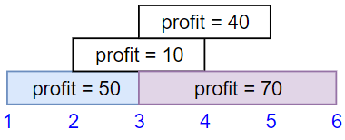

# LeetCode Problems

## Sumário
1. 

2. [#174. Dungeon Game](#174-dangeon-game-)

3. [#1235. Maximum Profit in Job Scheduling](#1235-maximum-profit-in-job-scheduling-)

##  🔶

## #174. Dungeon Game 🔴

The demons had captured the princess and imprisoned her in the bottom-right corner of a dungeon. The dungeon consists of m x n rooms laid out in a 2D grid. Our valiant knight was initially positioned in the top-left room and must fight his way through dungeon to rescue the princess.

The knight has an initial health point represented by a positive integer. If at any point his health point drops to 0 or below, he dies immediately.

Some of the rooms are guarded by demons (represented by negative integers), so the knight loses health upon entering these rooms; other rooms are either empty (represented as 0) or contain magic orbs that increase the knight's health (represented by positive integers).

To reach the princess as quickly as possible, the knight decides to move only rightward or downward in each step.

Return the knight's minimum initial health so that he can rescue the princess.

Note that any room can contain threats or power-ups, even the first room the knight enters and the bottom-right room where the princess is imprisoned.

**Exemple 1:**

**Input:** dungeon = [[-2,-3,3],[-5,-10,1],[10,30,-5]]

**Output:** 7

**Explanation:** The initial health of the knight must be at least 7 if he follows the optimal path: RIGHT-> RIGHT -> DOWN -> DOWN.

**Example 2:**

**Input:** dungeon = [[0]]

**Output: 1**

## Como resolvemos?

## #1235. Maximum Profit in Job Scheduling 🔴

We have n jobs, where every job is scheduled to be done from startTime[i] to endTime[i], obtaining a profit of profit[i].

You're given the startTime, endTime and profit arrays, return the maximum profit you can take such that there are no two jobs in the subset with overlapping time range.

If you choose a job that ends at time X you will be able to start another job that starts at time X.

**Exemple 1:**

**Input:** startTime = [1,2,3,3], endTime = [3,4,5,6], profit = [50,10,40,70]

**Output:** 120

**Explanation:** The subset chosen is the first and fourth job. 
Time range [1-3]+[3-6] , we get profit of 120 = 50 + 70.

**Exemple 2:**

**Input:** startTime = [1,2,3,4,6], endTime = [3,5,10,6,9], profit = [20,20,100,70,60]

**Output:** 150

**Explanation:** The subset chosen is the first, fourth and fifth job. 
Profit obtained 150 = 20 + 70 + 60.

**Exemple 3:**

**Input:** startTime = [1,1,1], endTime = [2,3,4], profit = [5,6,4]

**Output:** 6

## Como resolvemos?
