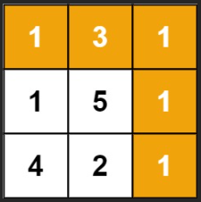
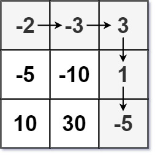

# LeetCode Problems

## Sumário
1. [#64. Minimum Path Sum](#64-minimum-path-sum-)

2. [#174. Dungeon Game](#174-dungeon-game-)

3. [#1235. Maximum Profit in Job Scheduling](#1235-maximum-profit-in-job-scheduling-)

## #64. Minimum Path Sum 🔶

Given a m x n grid filled with non-negative numbers, find a path from top left to bottom right, which minimizes the sum of all numbers along its path.

Note: You can only move either down or right at any point in time.

**Exemple 1:**



**Input:** grid = [[1,3,1],[1,5,1],[4,2,1]]

**Output:** 7

**Explanation:** Because the path 1 → 3 → 1 → 1 → 1 minimizes the sum.

**Example 2:**

**Input:**  grid = [[1,2,3],[4,5,6]]

**Output:** 12

## Como resolvemos?

Como fizemos esse depois do #174 da dungeon, vimos que eram muito parecidos, porém com um detalhe, não havia valores negativos, então acreditamos ser mais fácil, o que de fato foi.

Diferente do #174, decidimos fazer as alterações na própria matriz, para não gastar memória demasiada, e uma vez a matriz inicializada, fazemos a pergunta "É melhor pegar, o menor, o valor à esquerda ou o de cima?", lembrando sempre de somar com o valor da célula atual. Ao final, teremos exatamente a menor soma inde de (0,0) ao canto inferior direito.

## #174. Dungeon Game 🔴

The demons had captured the princess and imprisoned her in the bottom-right corner of a dungeon. The dungeon consists of m x n rooms laid out in a 2D grid. Our valiant knight was initially positioned in the top-left room and must fight his way through dungeon to rescue the princess.

The knight has an initial health point represented by a positive integer. If at any point his health point drops to 0 or below, he dies immediately.

Some of the rooms are guarded by demons (represented by negative integers), so the knight loses health upon entering these rooms; other rooms are either empty (represented as 0) or contain magic orbs that increase the knight's health (represented by positive integers).

To reach the princess as quickly as possible, the knight decides to move only rightward or downward in each step.

Return the knight's minimum initial health so that he can rescue the princess.

Note that any room can contain threats or power-ups, even the first room the knight enters and the bottom-right room where the princess is imprisoned.

**Exemple 1:**



**Input:** dungeon = [[-2,-3,3],[-5,-10,1],[10,30,-5]]

**Output:** 7

**Explanation:** The initial health of the knight must be at least 7 if he follows the optimal path: RIGHT-> RIGHT -> DOWN -> DOWN.

**Example 2:**

**Input:** dungeon = [[0]]

**Output:** 1

## Como resolvemos?

Pensamos inicialmente que a abordagem do menor caminho em um grafo poderia solucionar o problema, porém como tínhamos basicamente dois movimentos possíveis, direita ou baixo, decidimos trabalhar na própra matriz da dungeon.

Basicamente queremos o HP mínimo para o cavaleiro cruzar a dungeon, partindo da posição (0, 0), para o final, e para ele sair ele tem que ter pelo menos 1 de vida. Então iniciamos uma matriz onde guardaria os valores mínimos da vida do cavaleiro, sendo que as bordas teriam que ter pelo menos 1. E assim, indo de trás para frente, pegávamos o mínimo entre ir para direita e ir para baixo, e depois subtraíamos o valor da célula da dungeon.

Com isso a gente conseguiria colocar na matriz de vida, o HP mínimo de cada célula. Um exemplo prático para entender melhor:

Dungeon:
```bash
[[-2, -3, 3], 
[-5, -10, 1], 
[10, 30, -5]]
```
matriz_PD no começo:
```bash
inf   inf   inf   inf
inf   inf   inf   inf
inf   inf   inf   1
inf   inf   1     inf
```
```bash
Célula (2,2) - saída:
Custo -5
matriz_PD [2][3] = 1 (direita)
matriz_PD [3][2] = 1 (baixo)
```
Cálculo:
min(1, 1) - (-5) = 6
```bash
Matriz_PD atualizada:
inf   inf   inf   inf
inf   inf   inf   inf
inf   inf   6     1
inf   inf   1     inf
```
Ou seja, o valor de HP mímino qque o cavaleiro precisa ter ao chegar na saída, é 6.

E assim continuamos preenchendo a Matriz_PD.

## #1235. Maximum Profit in Job Scheduling 🔴

We have n jobs, where every job is scheduled to be done from startTime[i] to endTime[i], obtaining a profit of profit[i].

You're given the startTime, endTime and profit arrays, return the maximum profit you can take such that there are no two jobs in the subset with overlapping time range.

If you choose a job that ends at time X you will be able to start another job that starts at time X.

**Exemple 1:**


**Input:** startTime = [1,2,3,3], endTime = [3,4,5,6], profit = [50,10,40,70]

**Output:** 120

**Explanation:** The subset chosen is the first and fourth job. 
Time range [1-3]+[3-6] , we get profit of 120 = 50 + 70.

**Exemple 2:**


**Input:** startTime = [1,2,3,4,6], endTime = [3,5,10,6,9], profit = [20,20,100,70,60]

**Output:** 150

**Explanation:** The subset chosen is the first, fourth and fifth job. 
Profit obtained 150 = 20 + 70 + 60.

**Exemple 3:**


**Input:** startTime = [1,1,1], endTime = [2,3,4], profit = [5,6,4]

**Output:** 6

## Como resolvemos?

Utilizamos o algoritmo Weighted Interval Scheduling com Programação Dinâmica e busca binária para resolver este problema.

O problema #1235 (Maximum Profit in Job Scheduling) envolve uma abordagem de ordenação dos trabalhos pelo tempo de término. De forma sintetizada, ele resolve o problema de maximizar o lucro na programação de trabalhos (jobs) que possuem início e fim específico.

Em princípio, os trabalhos são organizados em ordem crescente, pelo horário de fim. Aí, então, para cada trabalho, é feita uma busca ao último trabalho que termina antes que comece o trabalho atual. Para isso, há a função bisect_right, garantindo que os trabalhos selecionados não se sobreponham.

A partir dessa informação, o algoritmo irá calcular o lucro máximo de duas maneiras:

	1. Levar: Considerando o trabalho atual (lucro do trabalho atual + máximo do últio trabalho compatível);
    
	2. Não Levar: Ignorando o trabalho atual (mantém o lucro acumulado até o trabalho anterior).

É armazenado junto ao algoritmo o lucro máximo acumulado em vetor_PD, garantindo que, ao final, o último valor possua o lucro máximo possível ao ser selecionado os trabalhos mais rentáveis e compatíveis.
