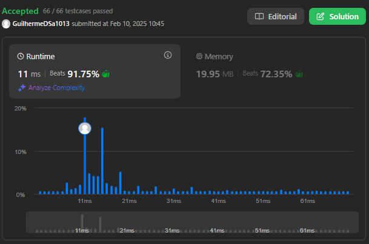

# LeetCode Problems - PD

**Número da Lista**: 29 
**Conteúdo da Disciplina**: Programação Dinâmica 

## Alunos
|Matrícula | Aluno |
| -- | -- |
| 211031575  |  Ana Karoliny de Souza Cavalcanti |
| 211031056  |  Guilherme de Sá Gonçalves |

## Sobre 
Esse projeto tem como objetivo armazenar as resoluções feitas dos seguintes exercícios do LeetCode:

- (Medium) - [#64. Minimum Path Sum](https://leetcode.com/problems/minimum-path-sum/description/)
- (Hard) - [#174. Dungeon Game](https://leetcode.com/problems/dungeon-game/description/?envType=problem-list-v2&envId=dynamic-programming)
- (Hard) - [#1235. Maximum Profit in Job Scheduling](https://leetcode.com/problems/maximum-profit-in-job-scheduling/description/)

## Screenshots

#64. Minimum Path Sum

#174. Dungeon Game

#1235. Maximum Profit in Job Scheduling

## Instalação 
**Linguagem**: Python3 

No caso, basta fazer uma conta no LeetCode, e ir no problema e copiar o código na resolução e testar. 

## Uso 
Porém caso não queira testar pelo LeetCode, basta clonar o repositório e rodar o arquivo com o nome do número do exercício, foram setados os mesmos exemplos de inputs que constam na descrição do problema.

## Outros 
Copiamos os problemas para o repositório, caso não queria abrir o LeetCode e queira ler a descrição do problema, clique [AQUI!!!](Problemas.md)

## Vídeos

[Explicação Trabalho (Drive)](https://drive.google.com/file/d/1cJS7QD52NOsUaK1bMXODtZccqD5vZlkn/view?usp=sharing)

[Explicação Trabalho (YouTube)](https://youtu.be/iWHOissxjBQ)
